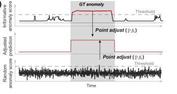
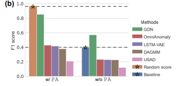
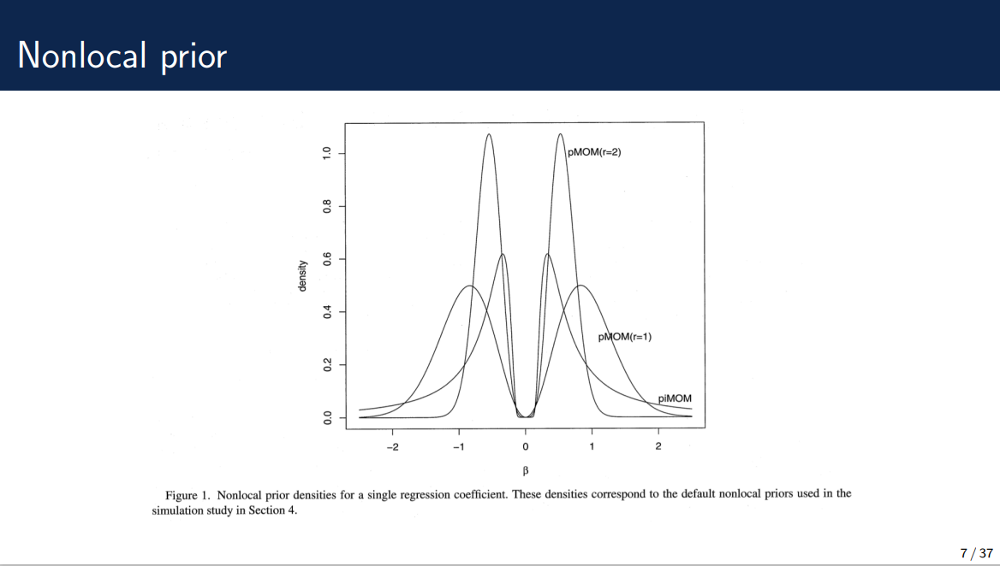
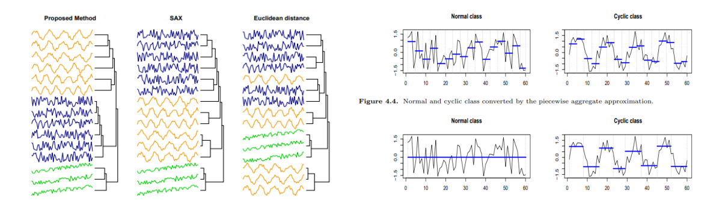
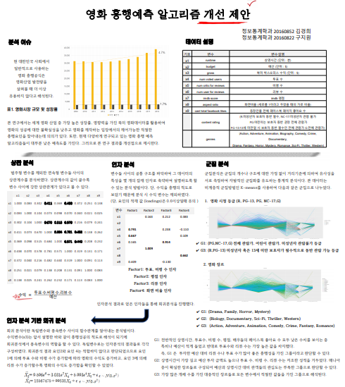

# Portfolio

---
## Time Series Outlier Detection and Clustering of Seoul Citizen Card User Behaviours (통계연구 22권0호 출판)

김경희. 2022. 서울시민카드 사용자 유입과 이탈에 대한 시계열 이상치 탐지와 DTW 클러스터링. 통계연구, 22(0) : 63-76

The study analyzes the inflow and departure of Seoul citizens' card users by gender and age group. First, fit the ARMA model and get estimates to detect outliers in univariate time series. Secondly, Dynamic Time Warping (DTW) clustering subsequently enables identify bound clusters. This study aims to help develop the use of Seoul citizens' cards by enhancing the understanding of user behaviours.

---
## Towards a Rigorous Evaluation of Time-Series Anomaly Detection (Review)

Anomaly detection; AD
As Industry 4.0 accelerates system automation, consequences of system failures can have significant social impact(Lee 2008). To prevent this failure, the detection of anomalous is more important. However, the paper introduces pitfalls of TAD evaluation and suggests some other methods to evaluate TAD rigorously.

---
## Bayesian Model Selection in High-Dimensional Settings (Review)

### Recent statistical techniques course, 2021-2nd sememster

In bayesian framework, mostly local prior is used for model select. In this paper, nonlocal prior would be better to model select for some reasons.
1. model consistency
2. less RMSE

---
## Time Series representation for clustering using umbalanced Haar wavelet transformation (Review)

Recent time series data tend to be very high-dimensional and high-frequency.  
Due to heavy computation, many studies have been conducted on the dimension reduction method to efficiently handle classification and clustering. (e.g. DFT, DWT, PAA)
In this paper, DUHT(Discrete Unbalanced Haar Wavelet Tramsformation, Fryzlewicz, 2007) is mainly used.

---
## Weather big data Contest  

### 대상/환경부장관상, 기상청 주관, Aug. 25, 2021.

Predicting landslides in Gyeongsang Province.  

Tool: R, Python  

Method: lgbm, xgboost, random forest.

---
## Creative Idea Contest in IT/Design Division

### 금상, 덕성여자대학교 주관, Nov. 27, 2020.

Suggestions to reduce resource consumption.

---
## College of Science and Technology Academic Conference

### 장려상, 덕성여자대학교 주관, Nov. 26, 2020.

Suggestions for movie box offcie success factors.  
Tool: R
Method: Factor analysis, K-means clustring, regression.

---
## Smart life ICT Convergence Idea APP Contest

### 우수상, 서울시·서울산업진흥원 주관, May, 30, 2017.

Suggest ideas and applications related to shared spaces of universities.  

Tool: R (Web app is also made by R, Shiny package).

---

© 2020 Khanh Tran. Powered by Jekyll and the Minimal Theme.

